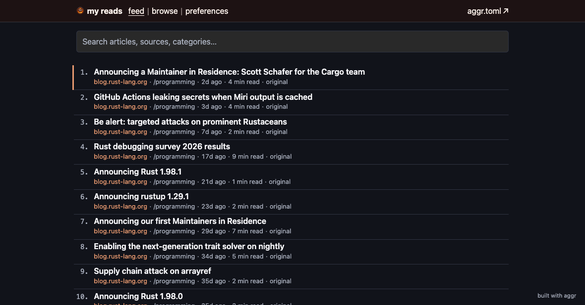
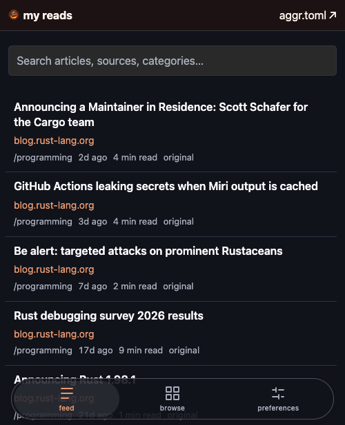

# aggr [](https://github.com/aymericbeaumet/aggr/actions/workflows/ci.yml)

[**Live demo**](https://aggr.aymericbeaumet.com) · [Create your reader](#create-your-reader) · [Browse the archive](https://github.com/aymericbeaumet/aggr-instance/tree/aggr)

A self-updating feed reader that saves articles as Markdown in your Git repository and publishes
a searchable static site. Follow websites, read on any device, and keep a copy when the original
disappears. No application server or separate database service to administer.

Source-available and free for personal and internal company use; see [the license](#license).

<p>
  
  
</p>

## Why aggr?

- **Own the archive.** Readable Markdown, original links, and capture dates live on a separate
  Git branch. Inspect, back up, or move the files with ordinary Git tools.
- **Hermetic after a sync.** Fetching is the only step that reaches the network. Once a sync has
  run, the site is a pure function of your repository and the binary: article text, images and the
  search index are all built from files you already have, so a rebuild is reproducible, works
  offline, and cannot be changed by a publisher editing or deleting the original.
- **Run your own reader.** A small `aggr.toml` and a scheduled workflow fetch sources and publish
  static files. GitHub Pages is the ready-made path; other Git and static hosts work too.
- **Keep reading.** Full-text search, mobile installation, keyboard navigation, and every page
  you have opened still readable with no network. New deployments update open feeds without
  interrupting an article.
- **Follow other instances.** Copy selected articles from another aggr repository into your own
  independent archive, preserving their original links.

Fetching runs on a schedule; the open reader checks for completed deployments every 15 seconds.
This is automatic updating, not a real-time delivery guarantee.

## Create your reader

1. [Fork the working instance](https://github.com/aymericbeaumet/aggr-instance/fork), keeping
   **Copy the main branch only** selected to start without the demo's archive.
2. Replace `aggr.toml` with the [small starter configuration](examples/starter.toml), then edit its
   title and sources. A website URL is enough; aggr discovers the feed.
3. In **Settings → Pages → Build and deployment**, set **Source** to **GitHub Actions**.
4. Open **Actions**, enable workflows, and run **aggr** on `main`. When it finishes, open the
   deployment link. Without a custom domain, it is `https://<you>.github.io/<repo>/`.

Edit the configuration before enabling Actions so the first run uses your sources.
The starter considers at most ten recent entries per source per run. Builds default to a 1 GB
limit: all article text takes priority, recent images keep their archived quality, and images
older than 30 days are compressed for publication. Media that cannot fit stays linked to its
publisher. The original Git archive is unchanged. See [build budgets](docs/build-budget.md).
The default GitHub setup publishes the reader and its archive publicly.

To try it locally instead:

```sh
mise use -g github:aymericbeaumet/aggr   # or download a binary from Releases
mkdir reads && cd reads && git init
aggr init
aggr dev                             # http://127.0.0.1:7319
```

`dev` does not commit or push. See [source configuration](docs/sources.md) for OPML, podcasts,
video channels, collections, and image options, or [hosting](docs/hosting.md) for deployment.

## Git is the database

```text
Your sources → scheduled sync → Markdown on the aggr branch → static reader
```

The main branch holds configuration; the unrelated `aggr` branch holds captured articles and
optional media. A no-op sync creates no commit. One broken source does not stop healthy sources.
Data history is append-only: retention removes files from the current tree, but older commits
remain available. It does not shrink the accumulated Git history.

```text
items/blog-rust-lang-org/2026/09/2026-09-22-announcing-a-maintainer-in-residence.md
items/blog-rust-lang-org/2026/09/2026-09-22-announcing-a-maintainer-in-residence.html
items/blog-rust-lang-org/2026/09/2026-09-22-announcing-a-maintainer-in-residence.preview-202cd0284a4a.webp
---
title: Announcing a Maintainer in Residence
link: https://blog.rust-lang.org/2026/09/22/maintainer-in-residence/
source: blog-rust-lang-org
published: 2026-09-22T00:00:00Z
first_seen: 2026-09-24T00:01:38Z
content: extracted
---
```

[Inspect real stored files](https://github.com/aymericbeaumet/aggr-instance/tree/aggr) or read the
[Git contract](docs/git-model.md). In a September 2026 snapshot, the 50-source demo held 2,314
article Markdown files and 4.38 GB of archive files, 99% of those bytes in images. Six incremental
runs had a median render time of 41 seconds and a total job time of 6 minutes 12 seconds.
See [the measurements and hosting limits](docs/benchmarks.md) before choosing your configuration.

## Know the tradeoffs

- Reading state and preferences stay in each browser; there is no cross-device read-state sync.
- Captures preserve readable content, not complete websites. Failed extraction can leave a feed
  summary or metadata; reading offline covers the pages you have opened, not the whole archive, and
  never the video or audio they embed.
- Public hosting republishes captured content. Search-engine indexing is opt-in, but `noindex`
  is not access control or permission to republish. Original links and attribution remain visible.
  See [publication and privacy](docs/hosting.md#publication-and-search-indexing).
- Git history and saved media grow. Retention bounds the current archive, not past commits;
  hosting limits and scheduled-run delays still apply.

## How is it different?

| Project | Focus |
|---|---|
| [Miniflux](https://miniflux.app) / [FreshRSS](https://freshrss.org) | Server-backed feed reading. They offer APIs or exports; aggr stores the archive directly as files in Git and serves a static reader. |
| [Bubo](https://github.com/georgemandis/bubo-rss) | A minimal static page of feed links. aggr also captures article content for reading and archiving. |
| [wallabag](https://wallabag.org) | Saving articles to read later. aggr centers on following sources automatically. |
| [ArchiveBox](https://github.com/ArchiveBox/ArchiveBox) | Broader web preservation, including scheduled feed imports. aggr centers on a feed reader and Markdown history in Git. |

## Documentation and contributing

[Sources](docs/sources.md) · [Reader](docs/reading.md) · [Commands](docs/commands.md) ·
[Hosting](docs/hosting.md) · [Themes](docs/themes.md) · [Git model](docs/git-model.md) ·
[Interoperability](docs/interoperability.md) · [Performance](docs/performance.md)

Rust generates the site; the browser client is hand-written HTML, CSS and JavaScript with no build
step and no dependencies. See [contributing](CONTRIBUTING.md) and
[client development](docs/client.md).

## License

[FSL-1.1-ALv2](LICENSE): source-available, free for personal and internal company use with no
trial period. A competing product or service requires separate permission. This is not an OSI
open-source license today, but it becomes one on a schedule: every version is additionally
licensed under Apache-2.0 two years after its release. Previously published MIT versions keep
their MIT terms.
See [licensing](docs/licensing.md) for examples, contribution terms, and third-party notices.
